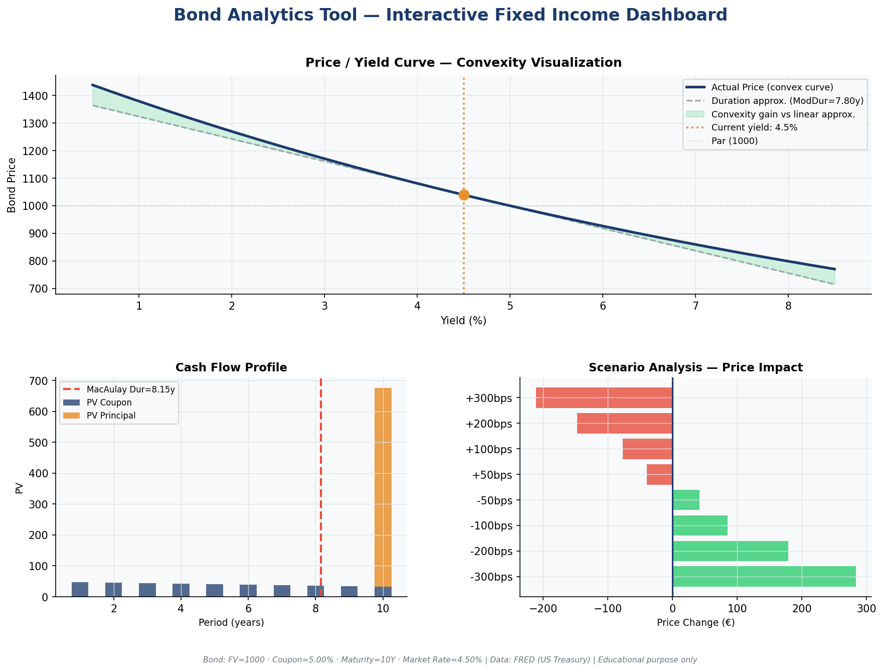

# bond-analytics-tool

> **Fixed income calculator: yield, duration, convexity, and price sensitivity — built from first principles.**

[](https://bond-analytics-tool-ytjriyszfuwcygbosn4ukc.streamlit.app/)

An interactive Streamlit dashboard implementing core fixed income analytics from the CFA Level 1 curriculum. All formulas are coded from scratch (no QuantLib) to demonstrate genuine understanding of the underlying mathematics.



---

## Financial Concepts

This project covers the essential fixed income toolkit:

| Concept | Implementation |
|---|---|
| **Bond Pricing** | DCF model: PV of coupons + PV of face value |
| **Yield to Maturity (YTM)** | Numerical solver (Brent's method) — rate equating price to cash flows |
| **Macaulay Duration** | Weighted average timing of cash flows |
| **Modified Duration** | Price sensitivity to a 1% yield change: `ΔP/P ≈ -ModDur × Δy` |
| **Convexity** | Curvature of the P/Y relationship — always benefits the holder |
| **Price/Yield curve** | Visual proof that convexity > linear (duration) approximation |
| **Sensitivity analysis** | `ΔP/P ≈ -ModDur × Δy + ½ × Convexity × Δy²` |
| **Live yield curve** | US Treasury rates from FRED — spread vs risk-free rate |

**Relationship to CFA L1**: Fixed Income readings (Chapters 42–46) — bond pricing, yield measures, duration, convexity.

---

## Stack

```
Python 3.10+  ·  Streamlit  ·  NumPy  ·  SciPy  ·  Pandas  ·  Matplotlib
Data: FRED (Federal Reserve Economic Data) — no API key required
```

---

## Quick Start

```bash
git clone https://github.com/MaheZK-R/bond-analytics-tool
cd bond-analytics-tool
pip install -r requirements.txt
streamlit run app.py
```

The app opens at `http://localhost:8501`. No API key needed — FRED data is public.

**Sample bonds** (in `data/sample_bonds.csv`): OAT 10Y, US Treasury 30Y, IG Corporate 5Y, Zero-Coupon, High Yield — use these to explore different duration/convexity profiles.

---

## Features

- **5-tab interface**: Metrics · Price/Yield curve · Cash flows · Sensitivity · Live yield curve
- **Interactive sliders**: Adjust coupon, maturity, market yield in real time
- **Convexity visualization**: See the gap between linear (duration) and actual (convex) price
- **Stress test**: ±n bps shock with duration effect, convexity adjustment, and approximation error
- **Scenario table**: Full ±300bps scenario analysis at a glance
- **FRED integration**: Live US Treasury yield curve with inversion detection
- **Credit spread calculation**: Automatic comparison of bond yield vs. nearest risk-free rate

---

## Key Insights

**1. Convexity always favors the bondholder.**
The price/yield curve is convex — for any yield move (up or down), the actual price is always *above* the linear (duration-only) approximation. The convexity adjustment term `½ × C × (Δy)²` is always positive.

**2. Long-maturity, low-coupon bonds have the highest convexity.**
More cash flows deferred to the future → greater sensitivity to yield changes → higher convexity. A 30Y zero-coupon bond has dramatically higher convexity than a 30Y 8% coupon bond.

**3. The approximation error grows non-linearly with the yield shock.**
For a ±100bps move, duration + convexity approximation is very accurate. For ±300bps, the higher-order terms become material. The `price_change_estimate()` method explicitly quantifies this error.

**4. Modified Duration ≠ Macaulay Duration.**
`ModDur = MacDur / (1 + y)`. The distinction matters: Macaulay is a time measure (years), Modified is a price sensitivity measure (% per %).

---

## Limitations

- **Annual coupon only** — no semi-annual convention (US bonds typically pay semi-annually; extending to semi-annual is a 2-line change)
- **Bullet bond structure** — no amortization, callable/putable features, or embedded options
- **Simplified YTM** — assumes flat reinvestment rate equal to YTM (the standard textbook assumption)
- **No accrued interest** — prices are quoted as full (dirty) price; clean price / settlement date not implemented
- **FRED fallback** — if the API is unreachable, approximate default rates are used (clearly flagged in UI)

---

## Project Structure

```
bond-analytics-tool/
├── app.py                  ← Streamlit UI entry point
├── src/
│   ├── bond.py             ← Bond class: pricing, duration, convexity (from scratch)
│   ├── fred.py             ← FRED API client — live Treasury rates
│   └── charts.py           ← Matplotlib visualizations
├── data/
│   └── sample_bonds.csv    ← 5 example bonds covering different profiles
├── assets/
│   └── demo.png            ← Screenshot for this README
├── requirements.txt
└── .gitignore
```

---

## References

- CFA Institute — *Fixed Income* (Level 1 Curriculum, Chapters 42–46)
- Fabozzi, F. — *Fixed Income Mathematics* (4th ed.)
- FRED API — https://fred.stlouisfed.org/docs/api/fred/
- Hull, J. — *Options, Futures, and Other Derivatives* — duration/convexity chapter

---

*Built for learning. Not financial advice.*
